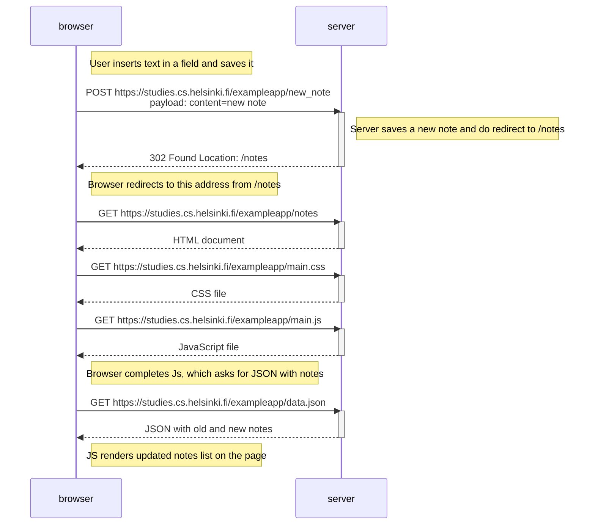

```mermaid
sequenceDiagram
    participant browser
    participant server

    Note right of browser: User inserts text in a field and saves it 

    browser->>server: POST https://studies.cs.helsinki.fi/exampleapp/new_note<br/>payload: content=new note
    activate server
    Note right of server: Server saves a new note and do redirect to /notes
    server-->>browser: 302 Found Location: /notes
    deactivate server

    Note right of browser: Browser redirects to this address from /notes

    browser->>server: GET https://studies.cs.helsinki.fi/exampleapp/notes
    activate server
    server-->>browser: HTML document
    deactivate server

    browser->>server: GET https://studies.cs.helsinki.fi/exampleapp/main.css
    activate server
    server-->>browser: CSS file
    deactivate server

    browser->>server: GET https://studies.cs.helsinki.fi/exampleapp/main.js
    activate server
    server-->>browser: JavaScript file
    deactivate server

    Note right of browser: Browser completes Js, which asks for JSON with notes

    browser->>server: GET https://studies.cs.helsinki.fi/exampleapp/data.json
    activate server
    server-->>browser: JSON with old and new notes
    deactivate server

    Note right of browser: JS renders updated notes list on the page
```
